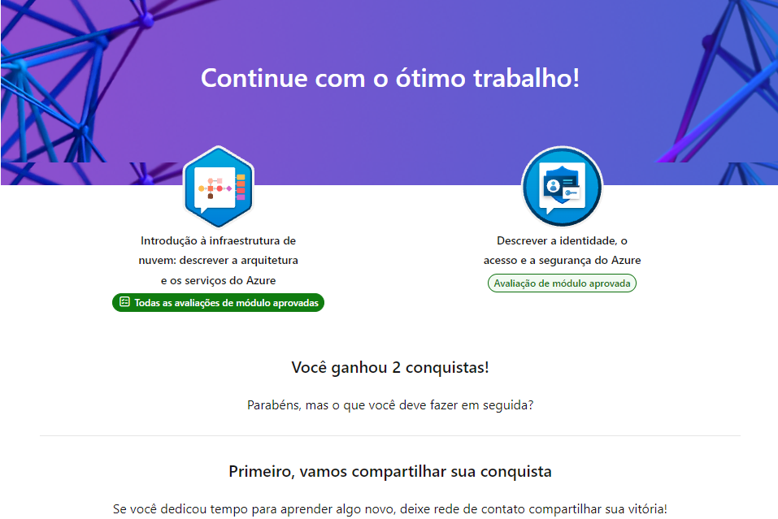

# Roteiro 2 — Descrever arquitetura e serviços do Azure

## O que aprendi

- Diferença entre **conta do Azure** e **assinatura (subscription)**: a conta é a identidade de acesso, a assinatura é o contêiner de cobrança e recursos.
- Estrutura hierárquica do Azure: **Conta → Grupos de Gerenciamento → Assinaturas → Grupos de Recursos → Recursos**.
- Tipos de conta disponíveis:
  - **Conta gratuita do Azure**: acesso a produtos populares por 12 meses + crédito nos primeiros 30 dias.
  - **Conta de estudante gratuita**: crédito de US$ 100 nos primeiros 12 meses, sem necessidade de cartão de crédito.
- Boas práticas de organização: usar grupos de recursos para agrupar itens relacionados (ex: todos os recursos de um mesmo app).

## Print de conclusão

---

# Roteiro 2 — Describe Azure Architecture and Services (EN)

## What I learned

- Difference between an **Azure account** and a **subscription**: the account is your access identity, the subscription is the billing/resource container.
- Azure's hierarchy: **Account → Management Groups → Subscriptions → Resource Groups → Resources**.
- Available account types:
  - **Azure Free Account**: 12 months of free access to popular products + credit for the first 30 days.
  - **Azure Student Account**: US$100 credit for 12 months, no credit card required.
- Best practice: use resource groups to keep related resources organized together.
