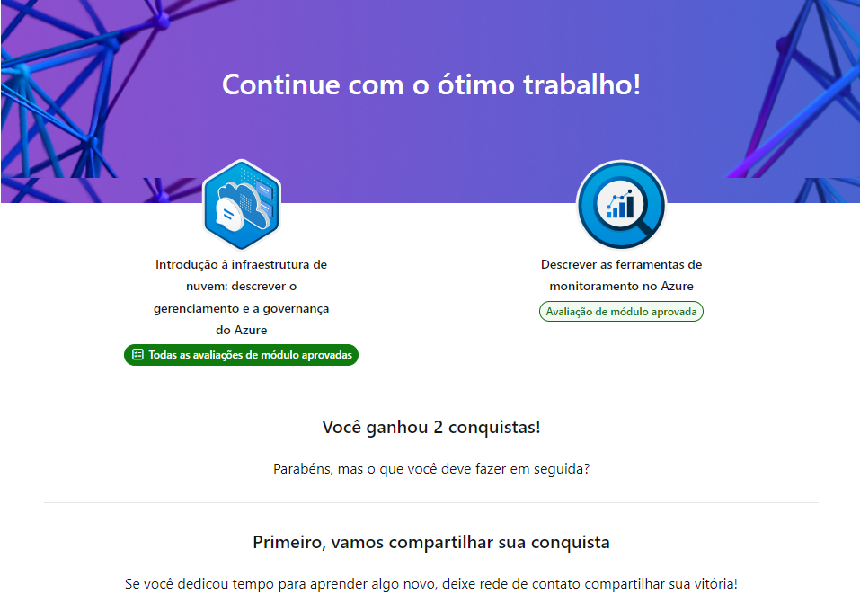

# Roteiro 3 — Descrever gerenciamento, governança e monitoramento do Azure

## O que aprendi

- Diferença entre **gerenciamento** (operar e manter recursos) e **governança** (definir regras e políticas de uso).
- **Azure Policy**: cria e aplica regras sobre como os recursos podem ser configurados (ex: exigir uma região específica).
- **Blueprints/Iniciativas**: agrupam várias políticas para padronizar ambientes.
- **RBAC (Controle de Acesso Baseado em Função)**: define quem pode fazer o quê em cada recurso.
- **Bloqueios de recursos (Resource Locks)**: evitam exclusão ou alteração acidental de recursos críticos.
- **Tags**: organizam e classificam recursos para cobrança e gestão (ex: por projeto, ambiente, responsável).
- **Azure Monitor**: coleta e analisa dados de telemetria de recursos, aplicações e infraestrutura.
- **Log Analytics**: consulta e analisa logs coletados em um só lugar usando linguagem KQL.
- **Alertas do Azure**: notificam automaticamente quando uma métrica ultrapassa um limite definido.
- **Azure Advisor**: recomenda melhorias de custo, segurança, desempenho e confiabilidade.

## Print de conclusão

---

# Roadmap 3 — Describe Azure management, governance and monitoring

## What I learned

- Difference between **management** (operating and maintaining resources) and **governance** (defining rules and usage policies).
- **Azure Policy**: creates and enforces rules on how resources can be configured (e.g., requiring a specific region).
- **Blueprints/Initiatives**: group multiple policies together to standardize environments.
- **RBAC (Role-Based Access Control)**: defines who can do what on each resource.
- **Resource Locks**: prevent accidental deletion or modification of critical resources.
- **Tags**: organize and classify resources for billing and management (e.g., by project, environment, owner).
- **Azure Monitor**: collects and analyzes telemetry data from resources, applications, and infrastructure.
- **Log Analytics**: queries and analyzes logs gathered in one place using KQL.
- **Azure Alerts**: automatically notify when a metric crosses a defined threshold.
- **Azure Advisor**: recommends cost, security, performance, and reliability improvements.
