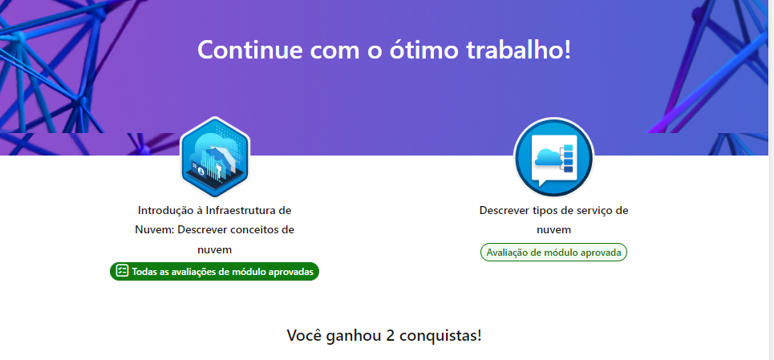

# Roteiro 4 – Introdução à Infraestrutura de Nuvem / Introduction to Cloud Infrastructure

## 🇧🇷 Português

### Módulos concluídos
- Descrever conceitos de nuvem
- Descrever tipos de serviço de nuvem (IaaS, PaaS, SaaS)

### Resumo
Aprendi os conceitos fundamentais de computação em nuvem, incluindo os
modelos de serviço (IaaS, PaaS, SaaS) e como eles se diferenciam em
termos de responsabilidade e controle entre provedor e cliente.

### Conquistas

---

## 🇬🇧 English

### Completed modules
- Describe cloud concepts
- Describe cloud service types (IaaS, PaaS, SaaS)

### Summary
I learned the fundamental concepts of cloud computing, including the
service models (IaaS, PaaS, SaaS) and how they differ in terms of
responsibility and control between provider and customer.

### Achievements

